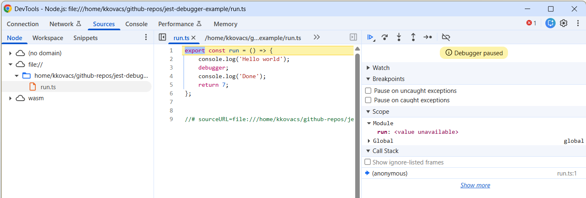

# Jest Node Debugger Example Repo

I am trying to use the debugger but I can't get it to work. This minimal sample
repo shows how I set up my project.

## Setup

1. Use basic `tsconfig.json` file.
1. Install stuff from npm
   (`npm i --save-dev typescript jest babel-jest @babel/core @babel/preset-env @babel/preset-typescript @jest/globals`).
1. Create `babel.config.js` as recommended.
1. Create a basic file (`run.ts`).
1. Create a test file (`run.test.ts`).

## Run WITHOUT Jest

1. Open Google Chrome and go to `chrome://inspect/#devices`.
1. Click on "Open dedicated DevTools for Node".
1. Run the program with `node --inspect-brk
1. Wait a few seconds
1. Boom, the debugger window picks up the code and everything is good to go.

## Run WITH Jest

1. Same as above, but run
   `node --inspect-brk ./node_modules/jest/bin/jest.js --runInBand` instead.
1. The debugger attaches, but none of the source code is there.
1. Now what?

## Notes

Here is a
[Stack Overflow question](https://stackoverflow.com/questions/79883201/how-do-you-get-node-inspector-to-pick-up-source-files-and-break-on-breakpoints)
that I asked about this, with no response and 1 close vote as of 02/09/26.

Here is a [GitHub issue](https://github.com/jestjs/jest/issues/15955) that I
opened against Jest about this.
